---
appunti di Python
---

# **CARICARE I DATI**

### **giusto ENCODING**
encoding='utf-8'

### **IMPOSTARE I NOMI DELLE COLONNE MENTRE SI CARICANO I DATI** 

#### **Convert commas decimal separators to dots within a Dataframe**

# **CAMBIARE FORMATO AI DATI**

	df['dates'] = pd.to_datetime(df['dates'], format='%d-%b-%Y')
	df['dates'] = pd.to_datetime(df['dates'], format='%Y%m%d')
	df['dates'] = pd.to_datetime(df['dates'], format='%d%m%Y')
	df['dates'] = pd.to_datetime(df['dates'], format='%d%b%Y')
	df['dates'] = pd.to_datetime(df['dates'], format='%d-%b-%Y')
	df['dates'] = pd.to_datetime(df['dates'], format='%Y%m%d%H%M%S')	
	df['dates'] = pd.to_datetime(df['dates'], format='%Y%m%d-%H%M%S')

#### **OBJ TO DATETIME**

#### **OBJ TO FLOAT**

| DATI||comando|note| 
|-|
|**CARICARE**|
|**INTERROGARE**||df.shape()				|
|||df.info()					|
|||df.unique()				|
|||df.value_counts()			|
|||df.quality.value_counts()	|
|||describe()				|
|||df['SalePrice'].describe()|
|**SISTEMARE**|
|**NaN**|conteggio|df.isnull().sum()|
||vederli graficamente|sns.heatmap(df.isna(), cmap="Reds_r") plt.show()|
||sostituirli|
|**outliers**|individuarli||Un valore anomalo di un set di dati è definito come un valore che è superiore a 3 deviazioni standard dalla media.  Usare boxplot| 
||Z-score treatment|scipy.stats.zscore()| le caratteristiche sono distribuite normalmente o approssimativamente normalmente|
||Filtraggio basato su IQR||quando la nostra distribuzione dei dati è distorta|
||Winsorization ||Questa tecnica funziona impostando un particolare valore di soglia, che decide in base alla nostra dichiarazione del problema. Manteniamo sempre la simmetria su entrambi i lati significa che se togliamo l'1% da destra poi a sinistra diminuiamo anche dell'1%.|
|||||
|||||
||eliminare i valori mancanti||Nel caso in cui manchino pochissimi valori, è possibile eliminare tali valori|
||sostituire con valore medio||per la colonna numerica. Prima di sostituire con valore medio, verificare che la variabile non debba avere valori estremi, ovvero **outlier**|
||sostituire con valore mediano||per la colonna numerica, puoi anche sostituire i valori mancanti con valori mediani. Nel caso in cui si abbiano **valori estremi come valori anomali** è consigliabile utilizzare l'approccio mediano|
||sostituire con valore modale||per la colonna categoriale,  sostituire i valori mancanti con valori modali, ovvero quelli frequenti|

# EDA

###  outliers

## Filling missing values using fillna(), replace() and interpolate()
https://www.geeksforgeeks.org/working-with-missing-data-in-pandas/

In order to fill null values in a datasets, we use fillna(), replace() and interpolate() function these function replace NaN values with some value of their own. All these function help in filling a null values in datasets of a DataFrame. Interpolate() function is basically used to fill NA values in the dataframe but it uses various interpolation technique to fill the missing values rather than hard-coding the value.

# **GRAFICI**

## boxplot df.boxplot(column=['colonnax'])

## boxplot intero DF
import numpy as np; np.random.seed(42)
import pandas as pd
import matplotlib.pyplot as plt
import seaborn as sns

df = pd.DataFrame(data = np.random.random(size=(4,4)), columns = ['A','B','C','D'])

sns.boxplot(x="variable", y="value", data=pd.melt(df))
plt.show()

## scatterplot
**tabella per personalizzare i colori**

https://github.com/pandas-dev/pandas/issues/16827

# PIVOT
https://towardsdatascience.com/3-tips-on-pandas-groupby-vs-sql-e6f85b07d6f0

# WEBSCRAPING
* **estrarre prezzi e prodotti da un sito di commercio online**
https://mansikkhatri8.medium.com/web-scraping-using-python-c21faca97532

* **Web Scraping with PythonWeb Scraping with Python**
https://nidhigajjar2000.medium.com/web-scraping-with-pythonweb-scraping-with-python-c8e6ec5021f5

* **Web Scraping Using Python(selenium and beautifulsoup modules**
https://dhruvdalsania2811.medium.com/web-scraping-using-python-selenium-and-beautifulsoap-modules-e8c68cc35781

# EDA
https://www.analyticsvidhya.com/blog/2020/08/exploratory-data-analysiseda-from-scratch-in-python/

### info of the dataset    
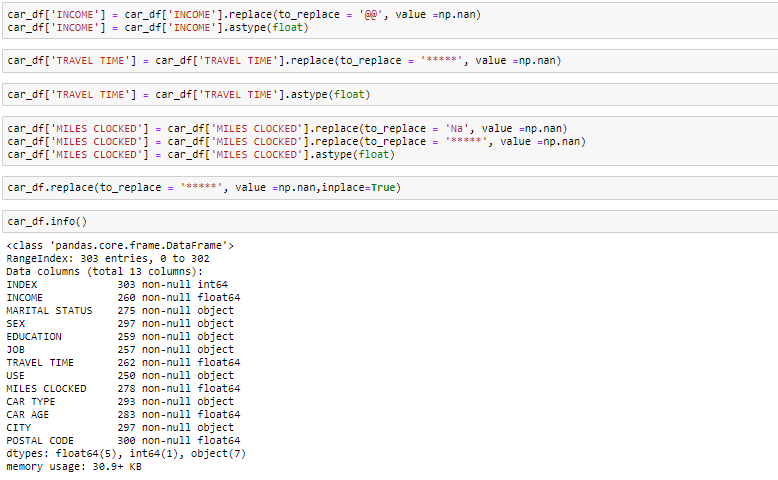

### summary of the dataset  
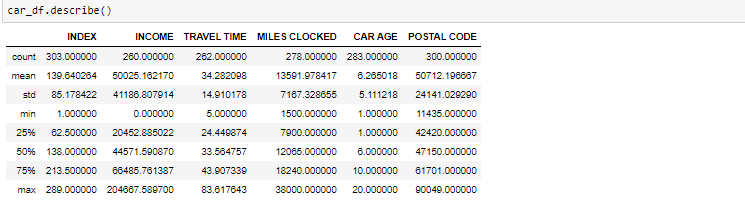
### Handle Missing value	
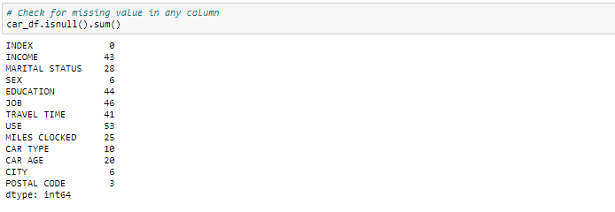
#### replace the numerical columns with median values and for categorical columns	
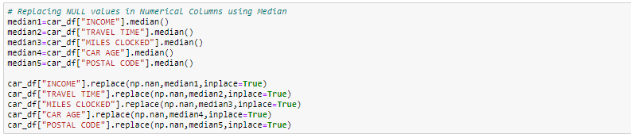
### Removing duplicates 
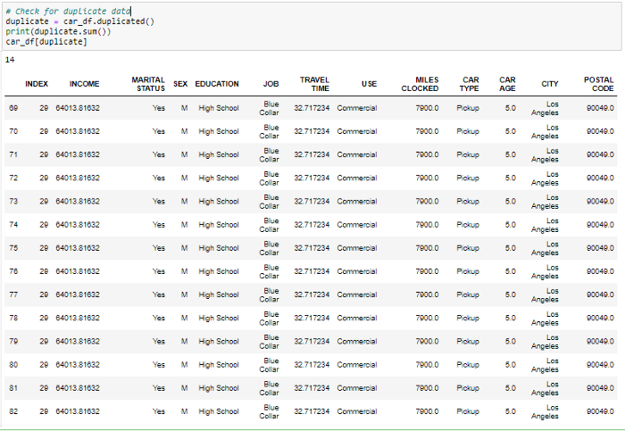

duplicate =df.duplucated()

print(duplicate.sum())

df[duplicate]

df.drop_duplicates(inplace=True)

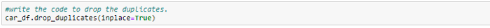

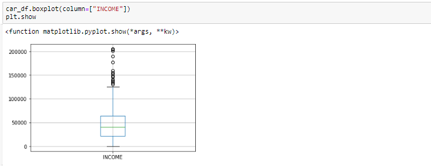
### Outlier Treatment

*    Drop the outlier value

*    Replace the outlier value using the IQR

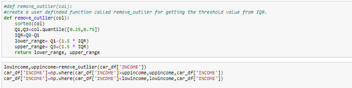

### Normalizing and Scaling( Numerical Variables)

### Encoding Categorical variables( Dummy Variables)

### Bivariate Analysis

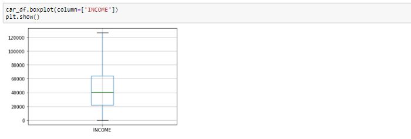

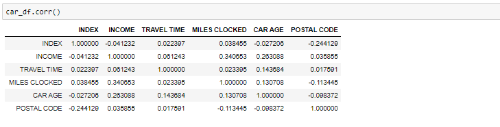

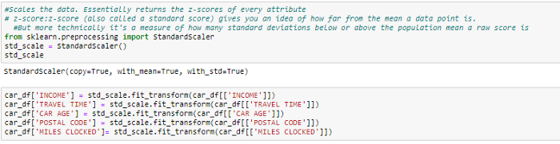

[Feature Selection in Machine Learning: Correlation Matrix | Univariate Testing | RFECV](https://zluna.medium.com/feature-selection-in-machine-learning-correlation-matrix-univariate-testing-rfecv-1186168fac12)

https://www.kaggle.com/ekami66/detailed-exploratory-data-analysis-with-python

## Pandas Profiling

pip install pandas-profiling

from pandas_profiling import ProfileReport
 
report = ProfileReport(df, title = "Sample Report")
 
report

report.to_html("report_file.html")

## SweetViz

import sweetviz as sv
 
sweet_report = sv.analyze(df)
 
sv.show_notebook()

sv.show_html()

### Comparing datasets with sweetviz

Sweetviz can also be used to compare two datasets. For example, if you want to compare training and validation datasets, you could do that with sweetviz.
	
compare_report = sv.compare([train_data, "Train"], [val_data, "Test"], "output")
 
compare_report.show_notebook()

This report will be similar to the one above, except it will break out the analysis by each dataset.

## AutoViz
	
	
[Prediction of credit risk based on transition system by Python](https://lengyi.medium.com/prediction-of-credit-risk-based-on-transition-system-by-python-cci-2-e81246c2bc0b)

